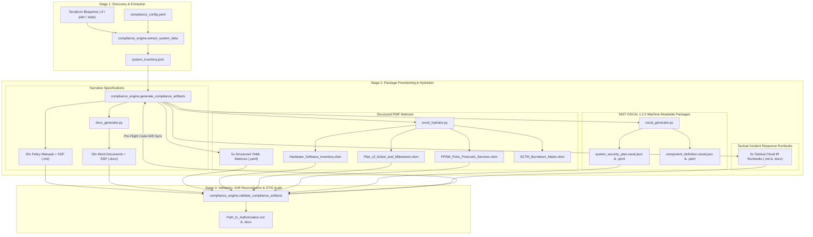

# Public Sector & Regulated Cloud Compliance Engine (`compliance_engine`)

The **Compliance Engine** automates the preparation of formal Authorization to Operate (ATO) packages across public sector and regulated cloud frameworks (NIST SP 800-53 Rev. 5, FedRAMP High/Moderate, DoD RMF / SRG IL4-IL6, StateRAMP, and CJIS).

The engine operates on a **modular, multi-stage architecture**: it discovers technical infrastructure facts directly from Terraform code and state, synthesizes regulatory control rules from official NIST guidance, and hydrates authoritative templates into dual-format deliverables (Markdown/DOCX for narratives, YAML/Excel for structured matrices, and JSON/YAML for machine-readable NIST OSCAL 1.2.3 schemas).

---

## System Architecture



---

## Modular Package Structure

The compliance engine follows a standard Python modular package layout, separating core business logic, validation suites, operational CLI entry points, templates, and configurations:

```text
.gemini/skills/compliance/
├── pyproject.toml                     # Modern PEP 517/518 build config & CLI console scripts
├── requirements.txt                   # Pinned dependency manifest with supply-chain policy
├── README.md                          # System architecture, package layout, and usage guide
├── SKILL.md                           # Gemini AI agent master operational skill definition & discovery specification
├── validate_skill.md                  # Final Master AI Validation & Drift Quality Gate ("Trust But Verify")
├── subskills/                         # Specialized AI Reviewer & Accuracy Checker subskills
│   ├── ssp_skill.md                   # System Security Plan (SSP) technical review & enrichment
│   ├── policies_skill.md              # 20 NIST SP 800-53 Rev. 5 Policy Manuals review & tailoring
│   ├── runbooks_skill.md              # Tactical Cloud Incident Response Runbooks review
│   ├── sctm_skill.md                  # Security Control Traceability Matrix (SCTM) review
│   ├── poam_skill.md                  # Plan of Action & Milestones (POA&M) review
│   ├── hwsw_skill.md                  # Hardware & Software Asset Inventory review
│   ├── ppsm_skill.md                  # Ports, Protocols & Services Matrix (PPSM) review
│   └── pta_skill.md                   # Path to Authorization (PTA) Strategy review
├── src/                               # Primary source tree (Python Data Plumbing Engine)
│   └── compliance_engine/             # Core named Python package
│       ├── __init__.py                # Package facade exposing public API surface & __version__
│       ├── py.typed                   # PEP 561 typing marker
│       ├── audit_log.py               # Tamper-evident NIST AU-2/AU-3/AU-9 audit logging
│       ├── docx_generator.py          # Pure-Python OpenXML Markdown-to-DOCX packager (.docx)
│       ├── excel_hydrator.py          # Macro-enabled Excel template hydration engine (.xlsm)
│       ├── export_strategies.py       # Decoupled export strategies with boundary confinement
│       ├── extract_system_data.py     # Stage 1: Technical discovery & variable extraction engine
│       ├── file_helpers.py            # Hardened path-traversal-resistant I/O & sanitization
│       ├── generate_compliance_artifacts.py # Stage 2: Dual-format master provisioning orchestrator
│       ├── hcl_parser.py              # Hardened Terraform HCL2 AST parser facade & canary check
│       ├── oscal_generator.py         # NIST OSCAL 1.2.3 & 1.1.0 SSP and Component Definition emitter
│       ├── poam_rules.py              # Deterministic POA&M weakness finding rules engine
│       ├── runbook_hydration.py       # Cloud incident response runbook hydration engine
│       ├── safe_xml.py                # Hardened defused XML parsing facade (CWE-611 / CWE-776)
│       ├── security_scanner_bridge.py # Static security scanner, live telemetry & SARIF bridge
│       ├── service_catalog.py         # GCP service catalog mapping APIs to NIST SP 800-53 families
│       ├── stig_resolver.py           # Dynamic DISA STIG / SRG version resolver & cache
│       ├── template_engine.py         # Deterministic template engine with linear-pass conditionals
│       ├── utils.py                   # Unified utility facades and logging helpers
│       └── validate_compliance_artifacts.py # Stage 3: Package validator & drift audit engine
├── scripts/                           # Operational CLI entry points & deployment runners
│   ├── extract_system_data.py         # Operational CLI script: Stage 1 Discovery
│   ├── generate_compliance_artifacts.py # Operational CLI script: Stage 2 Provisioning
│   ├── validate_compliance_artifacts.py # Operational CLI script: Stage 3 Validation & Audit
│   ├── run_tests.py                   # Test runner utility executing complete automated test suite
│   └── test_compliance_engine.py      # Backward-compatible legacy regression test runner shim
├── tests/                             # Comprehensive automated validation test suite
│   ├── __init__.py                    # Test suite bootstrap ensuring src/ on sys.path
│   ├── test_compliance_engine.py      # Core end-to-end integration regression test suite (81 tests)
│   ├── test_hardening_*.py            # 20 security hardening, edge-case, and boundary test modules
│   └── test_template_engine.py        # Template engine conditional, filter, and placeholder tests
├── config/                            # Authoritative configuration blueprints & catalogs
│   ├── compliance_config.yaml.example # Configuration template for system, organization, and roles
│   ├── gcp_service_catalog.yaml       # Authoritative GCP service-to-control family metadata
│   ├── reference_mappings.json        # Built-in FedRAMP/DoD reference mapping overrides
│   ├── stig_catalog.json              # Authoritative baseline DISA STIG / SRG checklist catalog
│   └── semgrep_rules/                 # Bundled offline SAST rulesets with CWE-to-NIST tags
│       └── public_sector_baseline.yaml
└── templates/                         # Authoritative starting baseline blueprints
    ├── hwsw/HWSWList_Template.xlsm    # Hardware & Software asset inventory workbook
    ├── poam/POAM_Export_Template.xlsm # Plan of Action & Milestones workbook
    ├── ppsm/PPSMBoundariesInformationExport_Template.xlsm # Ports, Protocols, & Services workbook
    ├── sctm/ControlInfoExport_Template.xlsm # Security Control Traceability workbook
    ├── policies/*.md                  # 20 NIST SP 800-53 Rev. 5 control family policy templates
    ├── runbooks/*.md                  # 5 tactical cloud incident response runbook templates
    ├── pta/Path_to_Authorization_Template.md # Master 6-Phase RMF execution roadmap
    └── ssp/
        ├── SSP_IL5_Template.md        # DoD Cloud Computing SRG IL5 baseline blueprint
        └── SSP_FedRAMP_High_Template.md # FedRAMP High baseline blueprint
```

---

## Output Deliverables in `<TARGET_FOLDER>/ato_artifacts/`

| Deliverable | Formats | Scope & Purpose |
| :--- | :--- | :--- |
| **System Security Plan (SSP)** | `.md`, `.docx` | Comprehensive NIST SP 800-53 Rev. 5 system boundary & control narratives. |
| **NIST OSCAL Packages** | `.json`, `.yaml` | Machine-readable NIST OSCAL 1.2.3 & 1.1.0 SSP and Component Definitions for automated FedRAMP, eMASS, and continuous GRC intake. |
| **20 Policy & Procedure Manuals** | `.md`, `.docx` | Complete policy manuals covering all 20 NIST SP 800-53 control families with executive cover headers and highlighted callout banners. |
| **HW/SW Asset Inventory** | `.yaml`, `.xlsm` | CM-8 asset inventory hydrated into DoD/FedRAMP macro-enabled Excel workbook. |
| **Plan of Action & Milestones (POA&M)** | `.yaml`, `.xlsm` | CA-5 continuous monitoring burndown matrix with 41 data columns and automated rule evaluation. |
| **Ports, Protocols, & Services (PPSM)** | `.yaml`, `.xlsm` | CA-3 network perimeter & API endpoint boundary matrix. |
| **Security Control Traceability (SCTM)** | `.yaml`, `.xlsm` | Control burndown matrix mapped in-place across rows 7..5,000+. |
| **FIPS Cryptography Matrix** | `.yaml`, `.md`, `.docx` | SC-12/SC-13 cryptographic module inventory, CMVP certs, and CMEK key matrix. |
| **Incident Response Runbooks (5 Workflows)** | `.md`, `.docx` | Tactical cloud incident response runbooks (Compromised Credentials, Compute Breach, CMEK Compromise, Network Intrusion, VPC-SC Violations) + extensible scenario template. |
| **Path to Authorization (PTA) & Validation Audit** | `.md`, `.docx` | Master 6-Step RMF execution roadmap, 14 ATC connection controls, dynamic DISA STIG mapping, eMASS direct entry guide, and Lead Assessor validation audit summary. |

---

## Local Setup & Installation

The Compliance Skill is **100% self-contained and modular**. It can be installed as a standard Python package or run directly via CLI scripts.

### 1. Dedicated Virtual Environment
```bash
python3 -m venv .gemini/skills/compliance/.venv
source .gemini/skills/compliance/.venv/bin/activate
```

### 2. Install Dependencies
Install the pinned dependencies into the virtual environment:
```bash
pip install -r .gemini/skills/compliance/requirements.txt
```

### 3. Required Hardened Parsers
The engine includes robust internal fallback parsers for baseline functionality. However, the independently audited external parsers are strictly required for compliance runs:
```bash
pip install 'defusedxml==0.7.1' 'python-hcl2==7.3.1'
```
*(Note: Omitting `python-hcl2` significantly reduces Terraform assessment coverage, falling back to a simplistic regex parser that silently excludes much of the estate from the accredited boundary. Historical upstream measurements recorded a drop from ~92% to ~33% coverage, though this varies by deployment. It is pre-pinned in `requirements.txt`.)*

### 4. Strict Supply-Chain Mode
In air-gapped or accredited environments, enforce strict local dependency isolation:
```bash
export COMPLIANCE_STRICT_DEPS=1
```

---

## Operational Workflow

The compliance provisioning lifecycle operates in three sequential stages:

### Step 1: Technical Discovery & Extraction
Scans the target workspace for Terraform declarations (`.tf`), variable assignments, state files, and application runtimes to generate `<TARGET_FOLDER>/system_inventory.json`:
```bash
python3 .gemini/skills/compliance/scripts/extract_system_data.py <TARGET_FOLDER>
```

### Step 2: Full Package Provisioning & Dual-Format Hydration
Synthesizes discovered infrastructure data, personnel configuration, and NIST guidance to generate the complete authorization package:
```bash
python3 .gemini/skills/compliance/scripts/generate_compliance_artifacts.py <TARGET_FOLDER> \
    --policy-format=both \
    --data-format=both \
    --oscal-format=both
```

### Step 3: Package Validation & DISA STIG Audit
Performs pre-flight code drift reconciliation, validates OpenXML and OSCAL schema integrity, verifies the 14 ATC connection controls, and generates the master `Path_to_Authorization.md` and `Path_to_Authorization.docx`:
```bash
python3 .gemini/skills/compliance/scripts/validate_compliance_artifacts.py <TARGET_FOLDER> --fix
```

---

## Automated Testing & Verification

The compliance engine maintains a comprehensive automated regression test suite covering all subsystems:
- **Core Test Suite**: Comprehensive tests spanning unit, integration, and security boundaries.
- **Coverage Areas**: Macro-enabled Excel hydration, OpenXML DOCX generation, OSCAL 1.2.3/1.1.0 schemas, ReDoS prevention, formula injection defense, path traversal confinement, and pre-flight drift repair.

### Running the Full Test Suite
Use the dedicated test runner utility, which will execute the entire test suite in the virtual environment:
```bash
python3 .gemini/skills/compliance/scripts/run_tests.py
```
*(Executes all tests with output summarization)*

---

## Installation and Discovery

To make this skill available to your Gemini agent:

1. **In-Repo Discovery**: By default, `GEMINI.md` provides explicit instructions to point the agent to `.gemini/skills/compliance`.
2. **Auto-Discovery**: If you prefer the skill to be automatically discovered as a first-class agent skill without relying on `GEMINI.md`, create a symlink to your global skills directory (this method is verified working):
   ```bash
   ln -s "$(pwd)/.gemini/skills/compliance" ~/.gemini/config/skills/compliance
   ```
