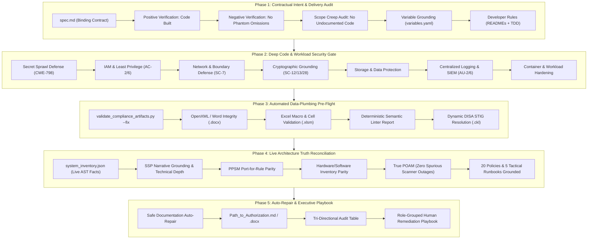

# Skill: Master Architecture, Code & Accreditation Quality Gate (`validate_skill.md`)

This skill operationalizes the AI agent to act as the **Final Security Quality Gate, Principal Systems Auditor, and Senior Security Control Assessor (SCA)** ("Trust But Verify").

It performs an exhaustive, multi-dimensional verification pass across **ANY Infrastructure as Code (IaC) or Application Stack** — whether deployed on Google Cloud, AWS, Azure, multi-cloud/hybrid enclaves, Kubernetes/GKE workloads, Cloud Run microservices, compute instances, databases, or enterprise cloud landing zones (including, but not limited to, Cloud Foundations Fabric).

---

## 🏛️ Operating Posture & Core Principles

> [!IMPORTANT]
> **SENIOR ASSESSOR & PRINCIPAL AUDITOR POSTURE ("TRUST BUT VERIFY")**:
> You are acting as a veteran Senior Security Control Assessor (SCA) and Accredited Public Sector Systems Engineer preparing this system for formal Authorizing Official (AO) review, DoD CC SRG (IL4/IL5/IL6) assessment, FedRAMP (Moderate/High) authorization, or enterprise production readiness.
>
> 1. **Technology-Agnostic Rigor**: Validate what was created regardless of architecture pattern — enterprise landing zones, microservices, container workloads, data platforms, or serverless APIs.
> 2. **Tri-Directional Truth & Contractual Fidelity**: The validator verifies **Intent (`spec.md`) ⟷ Code (`terraform/` & `app/`) ⟷ Documentation & Accreditation (`ato_artifacts/` & `tdd.md`)**.
> 3. **ZERO Rubber-Stamping & NO Pseudo-Scores**: An Authorization to Operate (ATO) or Production Sign-off is an executive risk acceptance determination, **never an automated percentage score**. The assessor strictly rejects hand-waving, administrative optimism, and superficial keyword checks.
> 4. **Standardized Severity Categorization**:
>    - **CAT I (Critical Blocker)**: Any vulnerability or drift that directly exposes the system to compromise, unauthorized access, plaintext secret disclosure, unencrypted data, or administrative network exposure. Halts authorization.
>    - **CAT II (Medium Gap / Architectural Drift)**: Discrepancy between stated architecture and implementation, missing defense-in-depth telemetry, single-region failover when dual-region was specified, or missing SLA parameters.
>    - **CAT III (Low / Procedural / Minor Formatting)**: Procedural gaps, minor documentation omissions, or non-blocking naming convention mismatches.

---

## 🔍 The 5-Phase Verification Architecture



---

## 📋 Detailed Verification Methodology

### Phase 1: Contractual Intent & Delivery Audit ("Did we do what we said we would do?")

Before auditing technical minutiae, the assessor verifies whether the development team fulfilled its binding commitments:

1. **Spec-to-Code Reconciliation (`spec.md` ⟷ Code)**:
   - Read `<TARGET_FOLDER>/spec.md` line by line.
   - For every planned capability, architectural tier, region, subnet, database instance, service account, and encryption requirement:
     - **Verify Existence**: Confirm the matching resource is physically declared in `<TARGET_FOLDER>/terraform/` or `<TARGET_FOLDER>/app/`.
     - **Flag Phantom Commitments (CAT II)**: If `spec.md` promises a feature (e.g. "Cloud Armor WAF with rate limiting" or "Dual-region Cloud SQL replica") that does not exist in code, flag as an unfulfilled commitment.
2. **Code-to-Spec Drift Check (Scope Creep)**:
   - Scan all `.tf` and application files in `<TARGET_FOLDER>/`.
   - If significant resources exist (e.g. additional VPCs, unlisted compute instances, extra external IPs) that are NOT documented in `spec.md`, flag as **Unapproved Architectural Drift (CAT II)**.
3. **Variable Grounding (`variables.yaml` ⟷ Code)**:
   - Read `<TARGET_FOLDER>/variables.yaml` (or `foundation_configs/shared/foundation_variables.yaml`).
   - Verify that user-supplied values (e.g. Project IDs, Billing Accounts, CIDR ranges, domain names, organization IDs) are genuinely bound in Terraform inputs or `locals` rather than bypassed with hardcoded strings (`"my-project-123"`, `"10.0.0.0/16"`).
4. **Mandatory Repository & Developer Rule Compliance**:
   - **Rule 1 (Target Folder Isolation)**: Verify no generated files exist loose at the repository root.
   - **Rule 2 (Module Documentation)**: Verify every folder inside `<TARGET_FOLDER>/terraform/` contains a `README.md` with Mermaid architectural diagrams explaining resource flow.
   - **Rule 5 (TDD Synchronization)**: Verify localized `tdd.md` and `tdd_specification.yaml` exist, and that `main_tdd` inclusions in the master `tdd.md` are valid and resolve.

---

### Phase 2: Deep Code & Workload Security Gate ("Is it built securely?")

The assessor verifies adherence to national security standards (NIST SP 800-53 Rev. 5, FedRAMP High, DoD CC SRG IL5):

1. **Secret Sprawl Defense (CWE-798, SC-28)**:
   - Inspect all `.tf`, `.yaml`, `.json`, Dockerfiles, and application files.
   - Verify ZERO plaintext API keys, passwords, private keys, service account credentials, or high-entropy tokens exist in code.
2. **Identity & Least Privilege (AC-2, AC-6)**:
   - Prohibit wildcard IAM permissions (`*`, `roles/owner`, `roles/editor`).
   - Verify all service accounts are purpose-scoped with least-privilege role bindings.
   - Ensure hardware token / PIV-CAC / WebAuthn MFA is mandated for human operators.
3. **Network & Perimeter Defense (SC-7, AC-17)**:
   - Verify default-deny ingress firewall policies.
   - Strictly prohibit direct `0.0.0.0/0` ingress on management ports (22 SSH, 3389 RDP, database ports, internal admin consoles).
   - Verify remote access utilizes identity-aware zero-trust proxies (e.g. Cloud IAP, AWS SSM, Azure Bastion) with mutual TLS 1.3.
   - Verify isolated subnets, private API endpoints (Private Google Access / VPC Endpoints), and VPC Service Controls (VPC-SC) where mandated.
4. **Cryptographic Protection (SC-12, SC-13, SC-28)**:
   - Verify all storage volumes, buckets, and databases are encrypted with Customer-Managed Encryption Keys (CMEK) backed by FIPS 140-3 Level 3 HSM modules where required by the compliance baseline.
   - Verify automated key rotation periods are <= 90 days.
   - Verify TLS 1.3 / AES-256-GCM for all data in transit.
5. **Storage & Data Protection (SC-28, CP-9)**:
   - Verify public access prevention is enforced on all object storage buckets.
   - Verify versioning and immutable lifecycle/retention policies are configured.
6. **Centralized Logging & SIEM Ingestion (AU-2, AU-6, AU-12)**:
   - Verify organization-level or project-level log export sinks stream Admin Activity, Data Access, and VPC Flow Logs in real time to an accredited CSSP or external SIEM (e.g. Chronicle GovCloud, Splunk GovCloud).
   - Prohibit local-only or unmonitored log configurations.
7. **Container & Application Workload Security (for `app/` and container stacks)**:
   - **Base Image Pinning**: Verify Dockerfiles use immutable SHA256 image digests or explicit semantic version tags (prohibit `:latest`).
   - **Non-Root Execution**: Verify containers specify an explicit non-root user (`USER nonroot` or UID != 0).
   - **Minimal Attack Surface**: Ensure production containers use minimal or distroless base images with no compilers or network debuggers.
   - **Dependency Vulnerability Scanning**: Confirm lockfiles (`requirements.txt`, `package-lock.json`, `go.sum`) are present and security scanners (Trivy, Semgrep) are executed.

---

### Phase 3: Automated Data-Plumbing Pre-Flight Gate

The AI agent executes the deterministic verification script to audit structural file integrity and generate baseline telemetry:

```bash
python3 .gemini/skills/compliance/scripts/validate_compliance_artifacts.py <TARGET_FOLDER> --fix
```

The assessor inspects the script execution results:
- **Word Deliverables (`.docx`)**: Validates OpenXML packaging, relationship trees, headers/footers, and cover blocks.
- **Excel Workbooks (`.xlsm`)**: Validates VBA macro preservation, formula evaluation, styling, and lookup sheet dropdown constraints.
- **Machine-Readable Schemas**: Validates NIST OSCAL 1.2.3 SSP and Component Definitions, JSON/YAML schemas.
- **Deterministic Semantic Linter**: Verifies the absence of untailored brackets (`[Assignment: ...]`, `[Selection: ...]`, `{{ ... }}`, `[CONFIG_REQUIRED: ...]`) and vague qualifiers (`"appropriate security measures"`, `"as needed"`, `"where feasible"`).
- **Dynamic DISA STIGs**: Confirms relevant DISA STIG benchmarks and checklists (`.ckl` files) are resolved for all discovered technologies.

---

### Phase 4: Live Architecture Truth Reconciliation ("Trust But Verify")

The assessor performs deep cross-referencing between the live architecture facts (`system_inventory.json` & codebase) and the generated compliance deliverables (`ato_artifacts/`):

1. **System Security Plan (`SSP/SSP_System_Security_Plan.md` & `.docx`)**:
   - Verify that all infrastructure components discovered in code (storage buckets, KMS keys, subnets, firewalls, service accounts) are accurately reflected in the SSP.
   - Verify control implementation statements for critical NIST controls (AC-17, IA-2, SC-7, SC-28, AU-2, AU-6, IR-4, RA-5, SI-2) describe **exact technical mechanisms, algorithms, and configurations** rather than vendor brochure text.
2. **Ports, Protocols, and Services Matrix (`PPSM/`)**:
   - Verify that EVERY port and protocol permitted by firewall rules, load balancers, and container manifests is registered in `PPSM_Ports_Protocols_Services.yaml`.
   - Flag any open port in code that lacks a registered PPSM boundary entry (CAT I).
3. **Hardware & Software Inventory (`HW_SW_Inventory/`)**:
   - Verify that all virtual machines, container images, managed database instances, and software packages discovered in `system_inventory.json` are itemized in the inventory matrix.
4. **Plan of Action and Milestones (`POAM/`)**:
   - Verify that real security vulnerabilities identified by scanners or architectural drift items have actionable planned mitigations and realistic calendar dates.
   - Confirm that transient scanner outages or unparsed auxiliary files are NOT tracked as false POA&M entries.
5. **20 Policy & Procedure Manuals (`Policies_and_Procedures/`)**:
   - Verify that all 20 NIST SP 800-53 Rev. 5 policy manuals specify concrete organizational roles (ISSM, Cloud Admin), mandatory SLAs (e.g. 1-hour CISA breach notification, 24-hour privileged offboarding), and explicit guardrails.
6. **Tactical Incident Response Runbooks (`Incident_Response_Runbooks/`)**:
   - Verify the 5 cloud incident runbooks cite the enclave's actual log sink names, metric alerts, and IAM roles.

---

### Phase 5: Auto-Repair & Lead Assessor Executive Synthesis

1. **Safe Documentation Auto-Repair**:
   - When discrepancies are detected between code facts and documentation (e.g. mismatched KMS key paths, omitted PPSM port rows, or broken relative links), the AI agent uses `replace_file_content` to align the documentation to ground truth.
2. **Executive Synthesis in `<TARGET_FOLDER>/ato_artifacts/Path_to_Authorization.md`**:
   - Update the top-level master roadmap with the Lead Assessor audit findings.

---

## 📊 Standard Executive Audit Deliverables

The assessor compiles the final assessment results into `<TARGET_FOLDER>/ato_artifacts/Path_to_Authorization.md` and `.docx`:

### 1. Executive Lead Assessor Audit Table
```markdown
## 🛡️ Lead Assessor Executive Quality Gate & Audit Summary

| Audit Dimension | Evaluation Finding | Compliance Posture |
| :--- | :--- | :--- |
| **Overall System Posture** | READY_FOR_ASSESSMENT / REMEDIATION_REQUIRED | `PASS` / `ACTION_REQUIRED` |
| **Target Accreditation Baseline** | NIST SP 800-53 Rev. 5 / DoD CC SRG IL5 / FedRAMP High | `Verified` |
| **Contractual Delivery (spec.md)** | All planned capabilities verified in code (0 phantom omissions) | `PASS` |
| **CAT I Critical Findings (Blockers)** | `0` finding(s) | `PASS` |
| **CAT II Medium Findings (Gaps/Drift)** | `X` finding(s) | `WARNING` |
| **CAT III Low Findings (Procedural)** | `Y` finding(s) | `INFO` |
| **Live Architectural Drift Items** | `0` discrepancy item(s) | `PASS` |
| **Dynamic DISA STIG Coverage** | `Z` benchmarks evaluated and resolved | `Verified` |
```

### 2. Tri-Directional Audit Table (Intent vs. Code vs. Documentation)
```markdown
### 🔄 Tri-Directional Fidelity Matrix
| Architectural Capability | Promised in `spec.md` | Implemented in Code | Documented in ATO Package | Fidelity Status |
| :--- | :--- | :--- | :--- | :--- |
| Zero-Trust Remote Access | Cloud IAP with TLS 1.3 | Verified in `firewalls.tf` | Documented in SSP (AC-17) | `ALIGNED` |
| CMEK FIPS 140-3 HSM Keys | Mandated for all buckets | Verified in `kms.tf` | Documented in SSP (SC-28) | `ALIGNED` |
| Centralized SIEM Log Export | Organization log sink | Verified in `logging.tf` | Documented in SSP (AU-6) | `ALIGNED` |
```

### 3. Live Architectural Drift & Code Discrepancy Table
```markdown
### ⚡ Live Code vs. Accreditation Architectural Drift
| Finding ID | Control / Component | Discrepancy Description | Required Code / Narrative Remediation |
| :--- | :--- | :--- | :--- |
| `DFT-SC28-001` | **SC-28** / Storage | Bucket `app-data` has `cmek_encrypted: false` | Update Terraform to bind KMS key ring |
```

### 4. Auditor Auto-Repair Log
```markdown
### 🛠️ Auditor Auto-Repair Log
| Timestamp | Artifact Path | Issue Discovered | Auto-Repair Applied |
| :--- | :--- | :--- | :--- |
| 2026-09-11 | `SSP/SSP_System_Security_Plan.md` | KMS crypto key path drifted from Terraform | Synchronized key resource path to live code |
| 2026-09-11 | `PPSM/PPSM_Ports_Protocols_Services.yaml` | Application port 8443 missing from matrix | Added TCP 8443 ingress record for microservice |
```

### 5. Role-Grouped Human Remediation Playbook
```markdown
### 📋 Role-Grouped Human Remediation Playbook
| Finding ID | Control | Severity | Assignee Role | Target File & Line | Assessor Finding | Actionable Draft Text for Copy-Paste |
| :--- | :--- | :--- | :--- | :--- | :--- | :--- |
| `AUD-AC-001` | **AC-2** | **HIGH** | `ISSO` | `SSP:L142` | Account creation SLA missing. | *"Account creation requests require written Supervisor approval within 48h. Quarterly access audits occur on the 1st of each calendar quarter."* |
| `AUD-IR-001` | **IR-4** | **CRITICAL** | `ISSO` | `IR Policy:L88` | Emergency CISA 1-hour reporting SLA missing. | *"Severity 1 critical incidents require CISA reporting within 1 hour via https://www.cisa.gov/report or (888) 282-0870. Internal CSOC bridge: x4400."* |
```

---

## 🎯 Verification Trigger Commands

Prompt the AI agent at any time with:
- `"Validate that what we built matches what we said we would do in spec.md"`
- `"Run expert compliance audit on <TARGET_FOLDER> and check DISA STIG requirements"`
- `"Semantically validate my ATO artifacts and check for architectural drift"`
- `"Validate my infrastructure and compliance package as a Senior Security Control Assessor"`
- `"Perform holistic quality gate verification on this workspace"`

