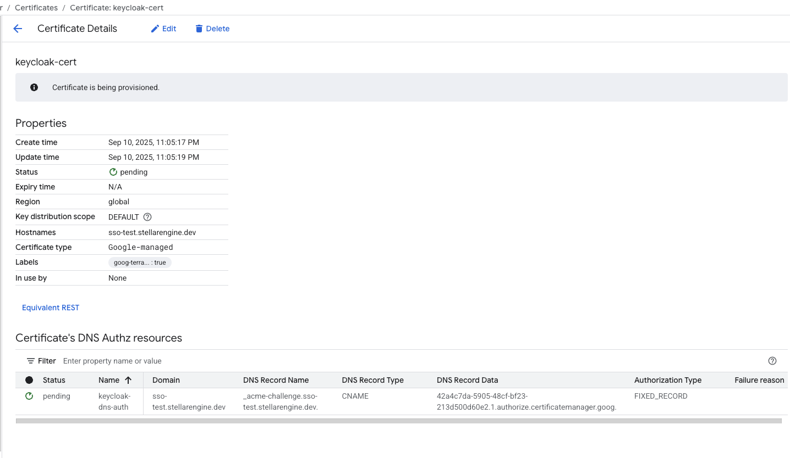
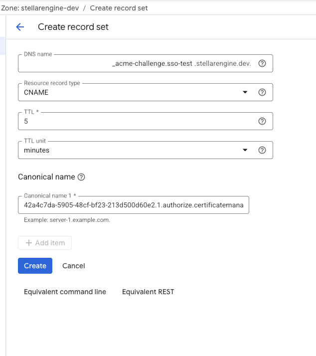
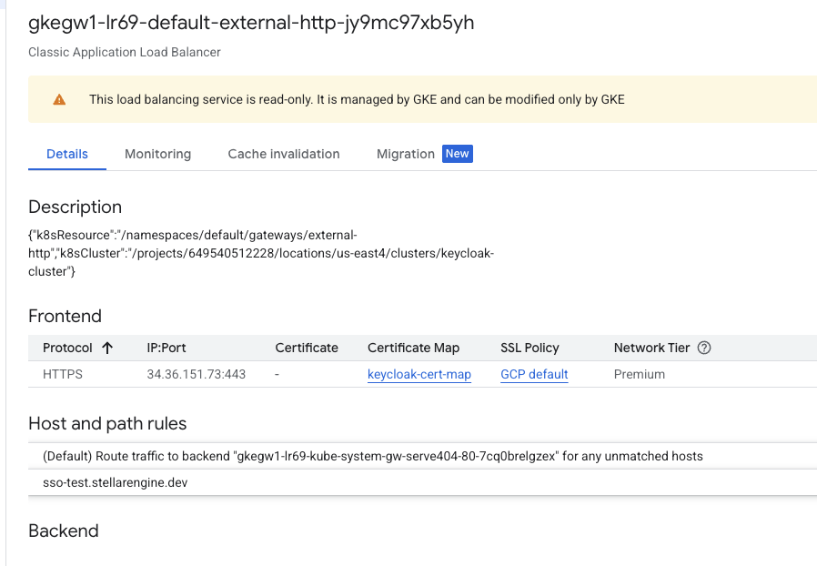
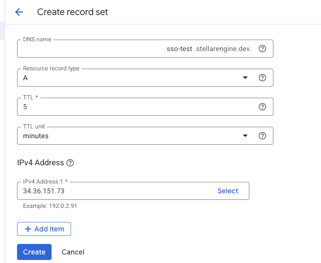

# Keycloak Blueprint
This blueprint deploys a keycloak instance on a GKE cluster and uses a Global External Load Balancer to forward traffic to the cluster. A postgres database is also deployed which you can configure to serve as the database for the keycloak instance.

## Pre-Requisite Steps
Before deployment two org policies need to be configured to allow for global load balancing.
Run this code after replacing with your project id:
```
cat <<EOF > lb_types.yaml
constraint: constraints/compute.restrictLoadBalancerCreationForTypes
listPolicy:
  inheritFromParent: true
  allowedValues:
  - EXTERNAL_HTTP_HTTPS
  - GLOBAL_EXTERNAL_MANAGED_HTTP_HTTPS
  - EXTERNAL_NETWORK_TCP_UDP
EOF

gcloud resource-manager org-policies set-policy lb_types.yaml --project=<PROJECT_ID>
```

Run this code after replacing with your project id:
```
cat <<EOF > global_lb.yaml
constraint: constraints/compute.disableGlobalLoadBalancing
booleanPolicy:
  enforced: false
EOF

gcloud resource-manager org-policies set-policy global_lb.yaml --project=<PROJECT_ID>
```

## Deployment Steps
```bash
cp terraform.tfvars.sample terraform.tfvars
```
Fill out the terraform.tfvars with the appropriate values for your own deployment.
```bash
terraform init
```
```bash
terraform plan
```
```bash
terraform apply
```

## Post-Requisite Steps
Please wait for up to 10 minutes after the deployment to give time for the GKE Gateway, Services, and Routes to be deployed. 

Navigate to the Certificate Manager page in the Google Cloud Console and click "keycloak-cert". Note the DNS authorization details as those will be used to validate the certificate.



Create a CNAME record wherever your DNS records are kept.



Navigate to the Load Balancer page in the Google Cloud Console and copy the IP address of the GKE load balancer that was created.



Create an A record wherever your DNS records are kept.



That is it, everything should be deployed and configured. The default credentials are admin:admin and it is highly recommended to create a new account and delete the admin account as soon as possible.
<!-- BEGIN TFDOC -->
## Variables

| name | description | type | required | default |
|---|---|:---:|:---:|:---:|
| [domain](variables.tf#L7) | Domain of the keycloak instance. | <code>string</code> | ✓ |  |
| [kms_key](variables.tf#L12) | Project path to a KMS key. | <code>string</code> | ✓ |  |
| [network](variables.tf#L17) | Network of the Bastion VM and GKE Cluster. | <code>string</code> | ✓ |  |
| [network_project_id](variables.tf#L22) | Project ID that hosts the VPC that will be used by keycloak. | <code>string</code> | ✓ |  |
| [pod_range](variables.tf#L33) | GKE pod range name. | <code>string</code> | ✓ |  |
| [project_id](variables.tf#L38) | ID of the project that keycloak will be deployed in. | <code>string</code> | ✓ |  |
| [service_range](variables.tf#L49) | GKE service range name. | <code>string</code> | ✓ |  |
| [subnetwork](variables.tf#L54) | Subnetwork of the Bastion VM and GKE Cluster. | <code>string</code> | ✓ |  |
| [bucket-name](variables.tf#L1) | Name of the bucket that will hold keycloak yaml files. | <code>string</code> |  | <code>&#34;keycloak-config&#34;</code> |
| [node_count](variables.tf#L27) | Amount of initial nodes in the nodepool. | <code>number</code> |  | <code>1</code> |
| [region](variables.tf#L43) | Region to deploy keycloak to. | <code>string</code> |  | <code>&#34;us-east4&#34;</code> |
<!-- END TFDOC -->
