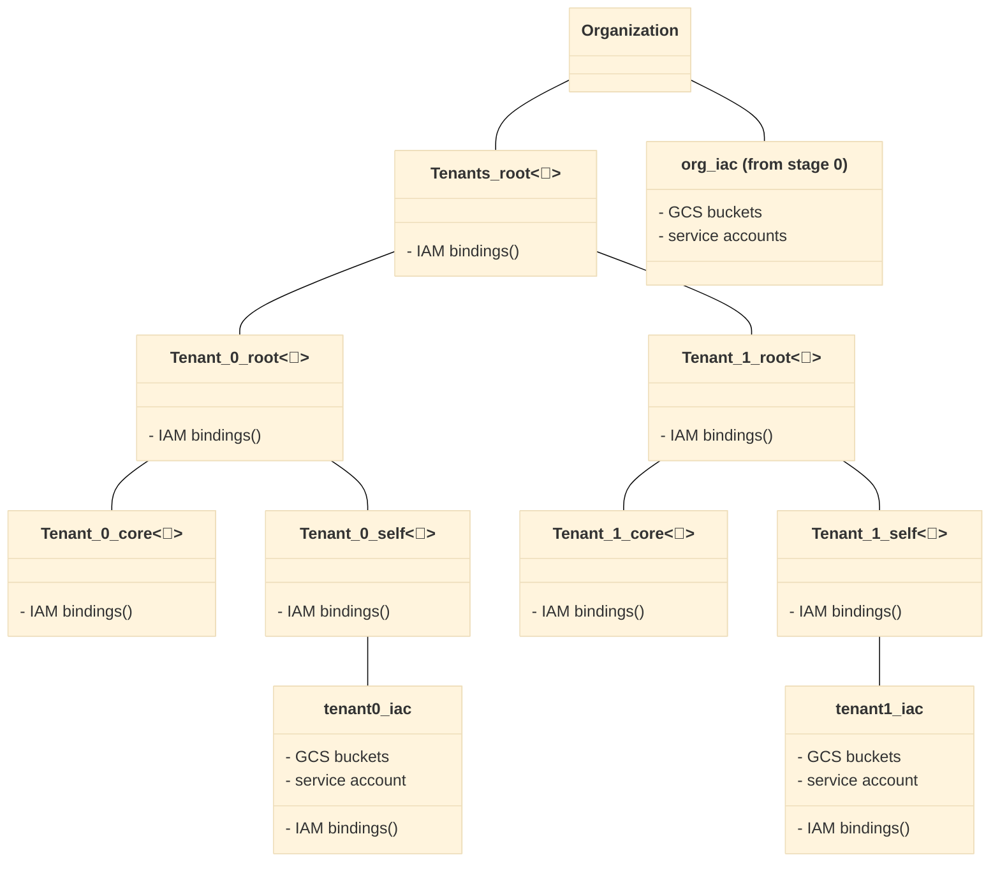

# Resource Hierarchy

This stage provisions an individual tenant's Google Cloud Folders, the Google Cloud projects contained within those folders, the tenant-specific Networking and tenant-specific logging resources. This stage can be used N number of times for N number of tenants without needing multiple folders per tenant.

# Table of Contents

<!-- BEGIN TOC -->
- [Table of Contents](#table-of-contents)
- [Design Overview and Choices](#design-overview-and-choices)
- [How to Run This Stage](#how-to-run-this-stage)
  - [Impersonating the Automation Service Account](#impersonating-the-automation-service-account)
  - [Lightweight multitenancy](#lightweight-multitenancy)
  - [IAM](#iam)
  - [Additional Google Cloud Folders](#additional-google-cloud-folders)
  - [Tenant Log Sinks](#tenant-log-sinks)
- [Variables](#variables)
- [Outputs](#outputs)
<!-- END TOC -->

## Design Overview and Choices

The design of this stage ensures that all resources for each tenant resides within a specified `Tenants` Google Cloud Folder within an Assured Workloads Google Cloud Folder; this prevents things like logs from living outside a compliant domain. This stage is designed to deploy a single tenant, but can be used to deploy N number of tenants. This allows each tenant to have its own state file and not utilize a monolithic state file for all tenants. This stage deploys all resources related to the tenant, including the tenant networking, logging and infrastructure.

## How to Run This Stage

There is a single providers file for this stage that allows for the backend GCS bucket to be passed in at runtime. To initialize this stage for a specific tenant, run the command `terraform init -backend-config="prefix=<TENANT_NAME>" -reconfigure`, where `TENANT_NAME` is the name of the tenant inside the GCS bucket. Once complete, any future Terraform commands will reference the state file located in `gs://<GCS_BUCKET_NAME>/<TENANT_NAME>` until the first command is re-ran to point to another tenant. To run terraform for another tenant, you need to run `terraform init -backend-config="prefix=<TENANT_NAME>" -reconfigure` with the new tenant's `TENANT_NAME`.

### Impersonating the Automation Service Account

The preconfigured provider file uses impersonation to run with this stage's automation service account's credentials. The `gcp-devops` and `organization-admins` groups have the necessary IAM bindings in place to do that, so make sure the current user is a member of one of those groups.

### Lightweight multitenancy

If the organization needs to support tenants without the full complexity and separation offered by our [full multitenant support](../../stages-multitenant/), this stage offers a simplified setup which is suitable for cases where tenants have less autonomy, and don't need to implement FAST stages inside their reserved partition.

This mode is activated by defining tenant in the `tenant` variable, while IAM configurations that apply to every tenant can be optionally set in the `tenant_config` variable.

The resulting setup provides a new "Tenants" branch in the Google Cloud Folder hierarchy with one second-level Google Cloud Folder for each tenant, and additional Google Cloud Folders inside it to host tenant resources managed from the central team, and tenant resources managed by the tenant itself. Automation resources are provided for both teams.

The default roles applied on tenant Google Cloud Folders are

- on the top-level Google Cloud Folder for each tenant
  - for the core IaC service account
    - `roles/cloudasset.owner`
    - `roles/compute.xpnAdmin`
    - `roles/logging.admin`
    - `roles/resourcemanager.folderAdmin`
    - `roles/resourcemanager.projectCreator`
    - `roles/resourcemanager.tagUser`
- on the core Google Cloud Folder for each tenant
  - for the core IaC service account
    - `roles/owner`
  - for the tenant admin group and IaC service account
    - `roles/viewer`
- on the tenant Google Cloud Folder for each tenant
  - for the tenant admin group and IaC service account
    - `roles/cloudasset.owner`
    - `roles/compute.xpnAdmin`
    - `roles/logging.admin`
    - `roles/resourcemanager.folderAdmin`
    - `roles/resourcemanager.projectCreator`
    - `roles/resourcemanager.tagUser`
    - `roles/owner`

Further customization is possible via the `tenants_config` variable.

This is a high level diagram of the design described above.



This is a list of the variables that need edited to set the Tenant name.

```tfvars
tenant = {
{{EDIT_THIS_VARIABLE_TO_THE_FIRST_TENANT_NAME}} =
  admin_principal  = "group:gcp-devops@example.com"
  name = "{{EDIT_THIS_VARIABLE_TO_THE_FIRST_TENANT_DESCRIPTION}}"
  locations = {
    gcs = "us-east4"
    kms = "us-east4" # Must match GCS Region
   }
 }
}
```

This is an example that shows a configured variable block with two example Tenants named `wingarch` and  `fuselagerd`.

```tfvars
tenants = {
wingarch =
  admin_principal  = "group:gcp-devops@example.com"
  name = "Wing Architect Research Group"
  locations = {
    gcs = "us-east4"
    kms = "us-east4" # Must match GCS Region
   }
 }
}
```

Providers and tfvars files will be created for each tenant.

### IAM

The `folder_iam` variable can be used to manage authoritative bindings for all top-level Google Cloud Folders. For additional control, IAM roles can be easily edited in the relevant `branch-xxx.tf` file, following the best practice outlined in the [bootstrap stage](../1-assured-workload#customizations) documentation of separating user-level and service-account level IAM policies through the IAM-related variables (`iam`, `iam_bindings`, `iam_bindings_additive`) of the relevant modules.

A full reference of IAM roles managed by this stage [is available here](./IAM.md).

### Additional Google Cloud Folders

Due to its simplicity, this stage lends itself easily to customizations: adding a new top-level branch (e.g. for shared GKE clusters) is as easy as cloning one of the `branch-xxx.tf` files, and changing names.

### Tenant Log Sinks

Tenant-specific folder logging sinks for tenants creates a centralize log route from tenant folders to dedicated log buckets during the stage they are created. This customization is integrated from the bootstrap stage where outputs are staged. It captures logs from the tenant folders, projects, and all their related activities including automated tenant mappings for routing purposes.

---
<!-- BEGIN TFDOC -->
## Variables

| name | description | type | required | default |
|---|---|:---:|:---:|:---:|
| [alert_email](variables.tf#L19) | Email to receive log alerts. | <code>string</code> | ✓ |  |
| [automation](variables.tf#L24) | Automation resources created by the bootstrap stage. | <code title="object&#40;&#123;&#10;  inputs_bucket           &#61; string&#10;  outputs_bucket          &#61; string&#10;  project_id              &#61; string&#10;  project_number          &#61; string&#10;  federated_identity_pool &#61; string&#10;  federated_identity_providers &#61; map&#40;object&#40;&#123;&#10;    audiences        &#61; list&#40;string&#41;&#10;    issuer           &#61; string&#10;    issuer_uri       &#61; string&#10;    name             &#61; string&#10;    principal_branch &#61; string&#10;    principal_repo   &#61; string&#10;  &#125;&#41;&#41;&#10;  service_accounts &#61; object&#40;&#123;&#10;    resman   &#61; string&#10;    resman-r &#61; string&#10;    tenant   &#61; string&#10;  &#125;&#41;&#10;  tenant_bucket &#61; string&#10;&#125;&#41;">object&#40;&#123;&#8230;&#125;&#41;</code> | ✓ |  |
| [cicd](variables.tf#L50) | Optional CICD variables to add Workload Identity Federation and a GitLab provider. | <code title="object&#40;&#123;&#10;  gitlab_project_path &#61; string&#10;  gitlab_uri          &#61; string&#10;  jwks_json           &#61; optional&#40;string&#41;&#10;&#125;&#41;">object&#40;&#123;&#8230;&#125;&#41;</code> | ✓ |  |
| [edge_group_id](variables.tf#L59) | ID of the edge group created in stage 3 for the spoke to join. | <code>string</code> | ✓ |  |
| [hub_id](variables.tf#L64) | ID of the hub created in stage 3 so we can add spokes to it. | <code>string</code> | ✓ |  |
| [ilb_ips](variables.tf#L69) | ILB IP addresses for each environment. | <code title="object&#40;&#123;&#10;  transit &#61; string&#10;&#125;&#41;">object&#40;&#123;&#8230;&#125;&#41;</code> | ✓ |  |
| [logging](variables.tf#L97) | Logging resources created by the bootstrap stage. | <code title="object&#40;&#123;&#10;  project_id        &#61; string&#10;  project_number    &#61; string&#10;  writer_identities &#61; optional&#40;map&#40;string&#41;&#41;&#10;  pubsub_topics     &#61; optional&#40;map&#40;string&#41;&#41;&#10;  service_accounts &#61; object&#40;&#123;&#10;    c5isr-pubsub &#61; string&#10;  &#125;&#41;&#10;&#125;&#41;">object&#40;&#123;&#8230;&#125;&#41;</code> | ✓ |  |
| [organization](variables.tf#L111) | Organization details. | <code title="object&#40;&#123;&#10;  domain      &#61; string&#10;  id          &#61; number&#10;  customer_id &#61; string&#10;&#125;&#41;">object&#40;&#123;&#8230;&#125;&#41;</code> | ✓ |  |
| [prefix](variables.tf#L127) | Prefix used for resources that need unique names. Use 7 characters or less. | <code>string</code> | ✓ |  |
| [tenant](variables.tf#L150) | Lightweight tenant definition for a single environment. | <code title="object&#40;&#123;&#10;  name                 &#61; string&#10;  macom                &#61; string&#10;  admin_principal      &#61; string&#10;  size                 &#61; string&#10;  tenant_specific_envs &#61; list&#40;string&#41;&#10;  compliance &#61; optional&#40;object&#40;&#123;&#10;    regime   &#61; string&#10;    location &#61; string&#10;  &#125;&#41;&#41;&#10;  locations &#61; optional&#40;object&#40;&#123;&#10;    gcs &#61; string&#10;    kms &#61; string&#10;  &#125;&#41;&#41;&#10;  organization &#61; optional&#40;object&#40;&#123;&#10;    customer_id &#61; string&#10;    domain      &#61; string&#10;    id          &#61; number&#10;  &#125;&#41;&#41;&#10;  spoke_subnets &#61; object&#40;&#123;&#10;    dev  &#61; string&#10;    test &#61; string&#10;    prod &#61; string&#10;  &#125;&#41;&#10;  tenant_groups &#61; optional&#40;map&#40;object&#40;&#123;&#10;    roles &#61; list&#40;string&#41;&#10;  &#125;&#41;&#41;&#41;&#10;  deploy_network_project &#61; optional&#40;bool&#41;&#10;&#125;&#41;">object&#40;&#123;&#8230;&#125;&#41;</code> | ✓ |  |
| [tenants_folder_id](variables.tf#L204) | The Overarching Tenant Folder inside of Dev. | <code>string</code> | ✓ |  |
| [locations](variables.tf#L77) | Optional locations for GCS, BigQuery, and logging buckets created here. | <code title="object&#40;&#123;&#10;  bq      &#61; string&#10;  gcs     &#61; list&#40;string&#41;&#10;  logging &#61; list&#40;string&#41;&#10;  pubsub  &#61; list&#40;string&#41;&#10;  kms     &#61; list&#40;string&#41;&#10;&#125;&#41;">object&#40;&#123;&#8230;&#125;&#41;</code> |  | <code title="&#123;&#10;  bq      &#61; &#34;US&#34;&#10;  gcs     &#61; &#91;&#34;US&#34;&#93;&#10;  kms     &#61; &#91;&#34;nam9&#34;&#93;&#10;  logging &#61; &#91;&#34;us&#34;&#93;&#10;  pubsub  &#61; &#91;&#93;&#10;&#125;">&#123;&#8230;&#125;</code> |
| [outputs_location](variables.tf#L121) | Enable writing provider, tfvars and CI/CD workflow files to local filesystem. Leave null to disable. | <code>string</code> |  | <code>null</code> |
| [regions](variables.tf#L138) | Region definitions. | <code title="object&#40;&#123;&#10;  primary   &#61; string&#10;  secondary &#61; list&#40;string&#41;&#10;&#125;&#41;">object&#40;&#123;&#8230;&#125;&#41;</code> |  | <code title="&#123;&#10;  primary   &#61; &#34;us-east4&#34;&#10;  secondary &#61; &#91;&#34;&#34;&#93;&#10;&#125;">&#123;&#8230;&#125;</code> |
| [tenant_config](variables.tf#L193) | Lightweight tenants shared configuration. Roles will be assigned to tenant admin group and service accounts. | <code title="object&#40;&#123;&#10;  core_folder_roles   &#61; optional&#40;list&#40;string&#41;, &#91;&#93;&#41;&#10;  tenant_folder_roles &#61; optional&#40;list&#40;string&#41;, &#91;&#93;&#41;&#10;  top_folder_roles    &#61; optional&#40;list&#40;string&#41;, &#91;&#93;&#41;&#10;&#125;&#41;">object&#40;&#123;&#8230;&#125;&#41;</code> |  | <code>&#123;&#125;</code> |

## Outputs

| name | description | sensitive |
|---|---|:---:|
| [gcs_iac_bucket](outputs.tf#L1) | IaC buckets. |  |
| [projects](outputs.tf#L11) | Tenant projects. |  |
| [service_accounts_automation](outputs.tf#L21) | Service accounts for automation. |  |
| [service_accounts_cicd](outputs.tf#L32) | Service accounts for CICD. |  |
| [vpc_networks](outputs.tf#L43) | Tenant VPC network. |  |
| [workload_identity_provider](outputs.tf#L59) | Name of Workload Identity GitLab provider. |  |
<!-- END TFDOC -->
